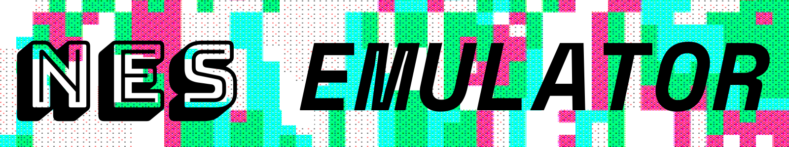
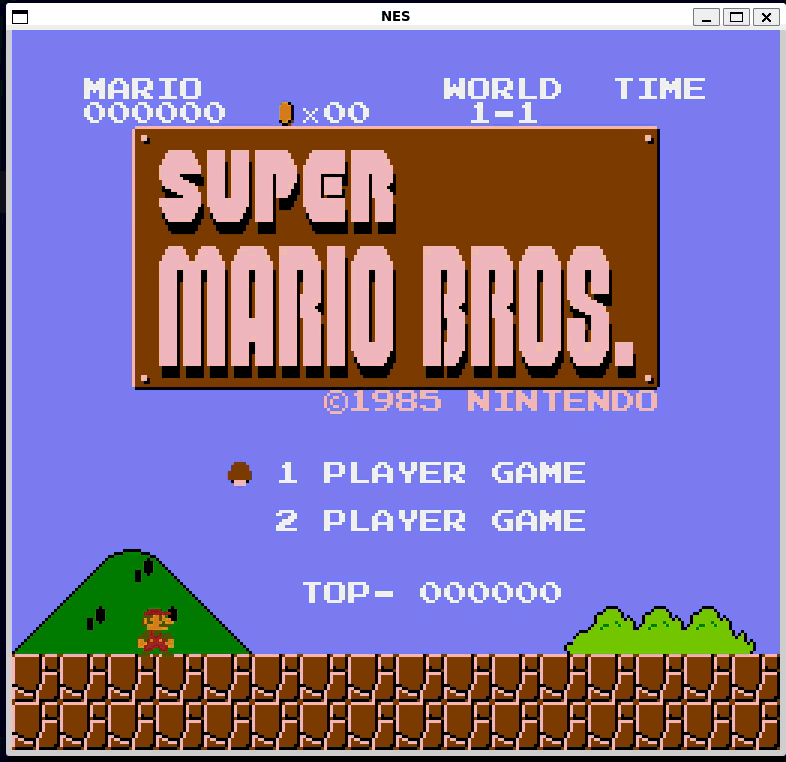
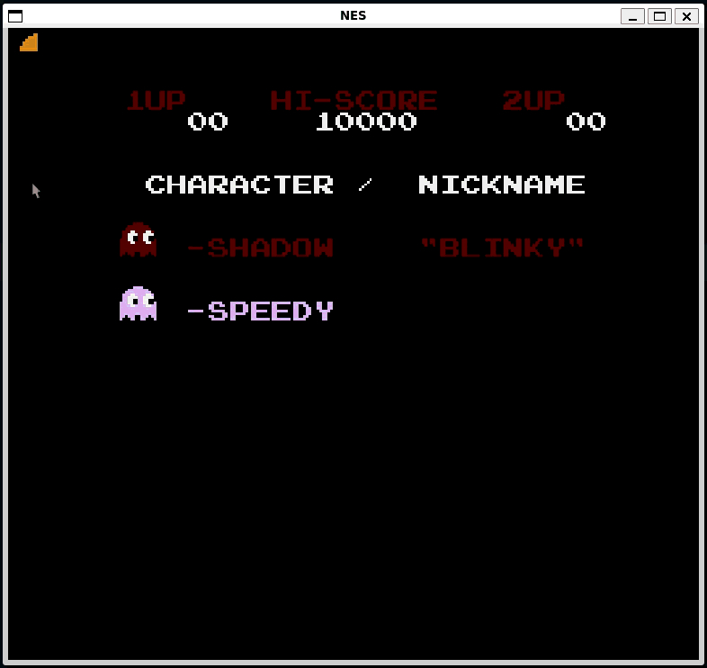
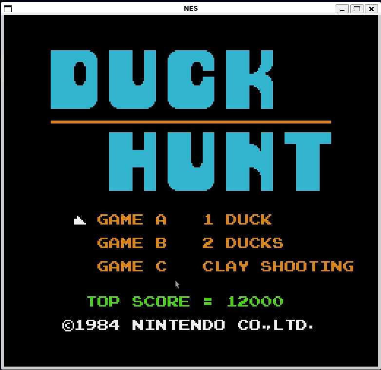
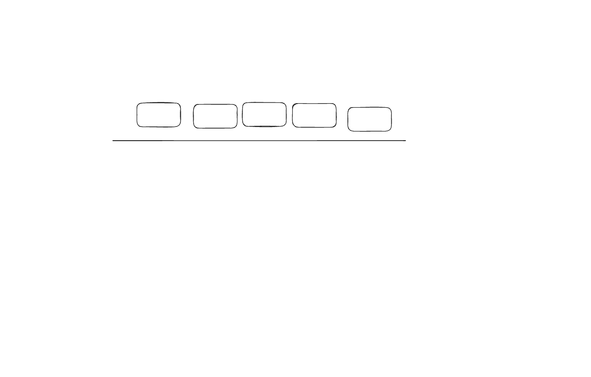

[](https://en.cppreference.com/w/cpp/20)
[](CMakeLists.txt)
[](LICENSE)

<p align="center">
  
</p>

---
<p align="center">
  
  
  
</p>

An NES emulator built from scratch in C++20 that runs real games with graphics, sound, and keyboard controls. Under the hood, it emulates the central processor (CPU), Picture Processing Unit (PPU), Audio Processing Unit (APU), memory bus, and cartridge mappers.

## Architecture
<p align="center">
  
</p>
TBD

| Component | Responsibility |
| --- | --- |
| `Cpu` | Instruction execution, interrupts, flags, stack, and cycle accounting |
| `Ppu` | Video memory, registers, rendering pipeline, sprites, and NMI timing |
| `Apu` | Audio channels, frame sequencer, IRQs, mixing, and sample generation |
| `Bus` | CPU memory map, device routing, DMA, controllers, and system clocking |
| `Cartridge` | iNES parsing, PRG/CHR storage, PRG RAM, mirroring, and mapper selection |
| `Mapper` | Cartridge-specific PRG/CHR bank switching and mirroring control |
| `Emulator` | Frame execution, reset coordination, controller input, and audio collection |

## Build

### Ubuntu or WSL2

Install the required tools and SDL2 development package:

```bash
sudo apt update
sudo apt install -y git build-essential cmake ninja-build libsdl2-dev
```

Clone and build:

```bash
git clone https://github.com/NicholasTerek/NES.git
cd NES
cmake -S . -B build -G Ninja -DCMAKE_BUILD_TYPE=Release -DNES_BUILD_TESTS=ON -DNES_BUILD_SDL=ON
cmake --build build --parallel
```

The SDL frontend requires a working desktop environment. On Windows, use WSL2 with
WSLg enabled or build the project natively with SDL2 available to CMake.

## Run

```bash
./build/nes_sdl "/path/to/game.nes"
```

## Test

Run the internal test suite:

```bash
ctest --test-dir build --output-on-failure
```
```bash
./build/nes_conformance "/path/to/test.nes" --frames 1800
./build/nes_conformance "/path/to/legacy-test.nes" --frames 1800 --legacy-f8
```

## Roadmap

- [ ] Add MMC3 / mapper 4 bank switching and scanline IRQs for games such as
      *Super Mario Bros. 3*, *Kirby's Adventure*, and *Mega Man 3-6*
- [ ] Persist battery-backed PRG RAM to `.sav` files
- [ ] Add PAL clock rates and frame timing
- [ ] Add SDL gamepad and second-controller bindings
- [ ] Add Zapper input and light detection
- [ ] Add save states and debugging tools

## License

This project is available under the [MIT License](LICENSE).
